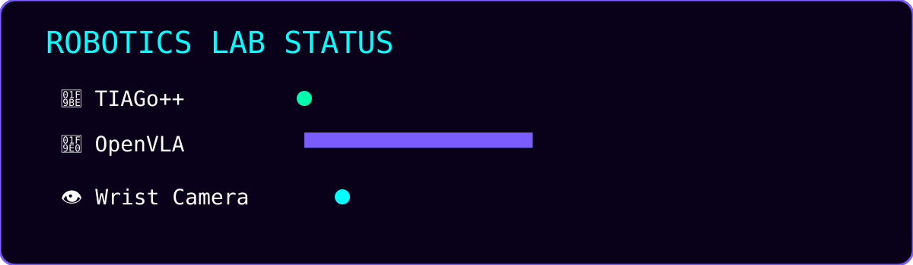
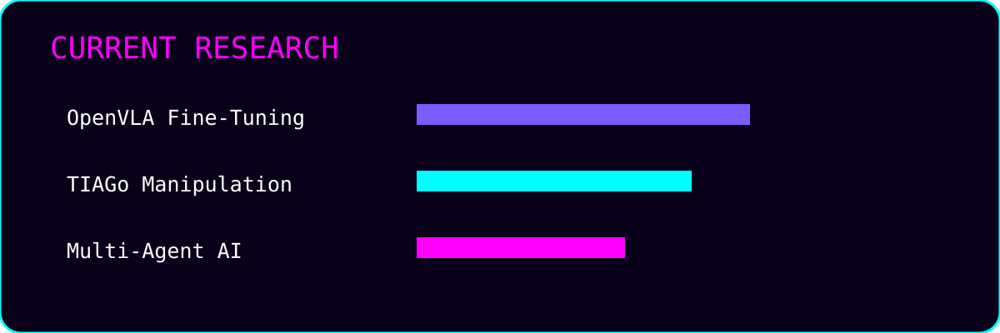

<div align="center">


<br>


<br>


</div>

<p align="center">

<i>
"Bridging Artificial Intelligence and Robotics through Vision-Language-Action Models."
</i>

</p>

<p align="center">


</p>


# 🚀 About Me

```python
class LorenzoGuiducci:

    role = "Robotics Engineer"

    interests = [
        "Vision-Language-Action Models",
        "Robot Manipulation",
        "Foundation Models",
        "Computer Vision",
        "Embodied AI",
        "Multi-Agent Systems"
    ]

    currently_working_on = [
        "OpenVLA Fine-Tuning",
        "Robot Learning",
        "TIAGo Manipulation",
        "ROS",
        "MoveIt",
        "PyTorch"
    ]

    motto = "Teaching robots to understand and manipulate the real world."
```


# 🔬 Current Research



## 🤖 Vision-Language-Action Models

Research and development of Vision-Language-Action models for embodied intelligence and robotic manipulation.

Current focus:

* Fine-tuning foundation models
* Robot action prediction
* Vision-based control
* Learning from demonstrations

---

## 🦾 TIAGo Robot Manipulation

Developing autonomous manipulation pipelines using TIAGo robot platforms.

Pipeline:

```
Camera Input
      ↓
Computer Vision
      ↓
Object Understanding
      ↓
Grasp Planning
      ↓
Motion Planning
      ↓
Robot Execution
```

Technologies:

* ROS
* MoveIt
* Gazebo
* OpenCV
* YOLO
* SAM
* Grasp Detection

---

## 🧠 Multi-Agent AI Systems

Designing intelligent agents capable of:

* reasoning
* planning
* collaboration
* interaction with robotic environments


# ⚡ Featured Projects

## 🦾 OpenVLA + TIAGo

Vision-Language-Action model fine-tuning for robotic manipulation.

Features:

* Custom robotic dataset
* Wrist-mounted camera data
* Action prediction
* Real robot execution

<div align="center">


</div>

---

## 📷 Hand-Eye Dataset Collection

Framework for collecting robot demonstrations using wrist-mounted cameras.

Includes:

* RGB image acquisition
* Robot state extraction
* End-effector tracking
* Dataset generation
* Robot trajectories

<div align="center">


</div>

---

## 🎯 Robotic Manipulation Pipeline

Complete perception-to-action pipeline:

```
Detection
    ↓
Segmentation
    ↓
Pose Estimation
    ↓
Grasp Generation
    ↓
Motion Planning
    ↓
Execution
```

Stack:

YOLO • SAM • OpenCV • MoveIt • ROS

---

## 🤖 Multi-Agent Robotics

Exploring autonomous AI systems where multiple agents collaborate for:

* task planning
* decision making
* robot control


# 🛠 Tech Stack

## Robotics

<p>


</p>

## Artificial Intelligence

<p>


</p>

## Computer Vision

```
OpenCV
YOLO
SAM
GraspNet
Transformers
HuggingFace
```


# 📊 GitHub Statistics

<p align="center">


</p>

<p align="center">


</p>


# 🏆 GitHub Achievements

<p align="center">


</p>


# 📈 Contribution Activity

<p align="center">


</p>


# 🌌 Live Research Dashboard




# 🐍 Contribution Snake

<p align="center">


</p>


# 📫 Let's Connect

Interested in:

* Robotics
* Artificial Intelligence
* Vision-Language-Action Models
* Robot Learning
* Multi-Agent Systems

Feel free to connect!

<br>

<div align="center">


### ⚡ Building the next generation of intelligent robots.

</div>
