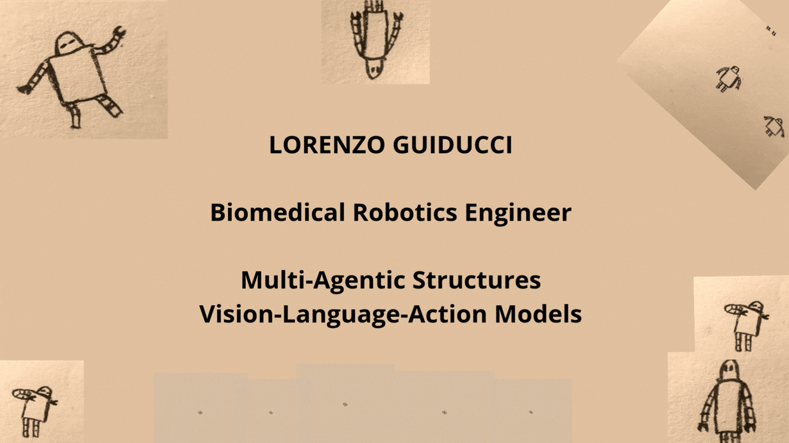

<div align="center">



<br><br>


<br>

<p align="center">

<a href="https://linkedin.com/in/YOUR_LINKEDIN"></a>
<a href="mailto:YOUR_EMAIL@domain.com"></a>
<a href="https://scholar.google.com/"></a>

</p>

<p align="center">


</p>

<i>"Bridging Artificial Intelligence and Physical Robotics through Embodied Foundation Models."</i>

</div>


# 🚀 About Me

```python
class LorenzoGuiducci:
    role = "Robotics & Embodied AI Researcher"
    domain = ["Vision-Language-Action (VLA) Models", "Autonomous Manipulation"]
    
    interests = [
        "VLA Fine-Tuning & Quantization",
        "Robotic Manipulation & Grasping",
        "Spatial AI & Promptable Segmentation",
        "Multi-Agent Task Allocation (MATA)",
        "Demonstration-based Learning (LfD)"
    ]

    active_stack = [
        "TIAGo Robot (PAL Robotics)",
        "OpenVLA / Octo / RT-X",
        "ROS / ROS 2 / MoveIt",
        "PyTorch / HuggingFace Transformers",
        "Gazebo Simulation Environment"
    ]

    motto = "Teaching robots to perceive, reason, and act seamlessly in human environments."

```

# 🔬 Research & Technical Focus

### 🤖 Vision-Language-Action (VLA) & Embodied AI

Research on end-to-end multi-modal models mapping visual observations and natural language instructions directly into executable robot end-effector control actions.

* Fine-tuning OpenVLA frameworks on custom trajectory datasets.
* Cross-domain generalization (sim-to-real transfer).
* Real-time inference optimization for low-latency robotic loops.

---

### 🦾 TIAGo Manipulation & Spatial Perception

Developing modular perception-to-action control pipelines using the **TIAGo** mobile manipulator platform.

```
📷 RGB-D / Wrist Cam ──► 🧠 Computer Vision ──► 🎯 6D Pose & Grasp ──► 🦾 Motion Planning ──► 🤖 Execution
                        (YOLO / SAM / DINO)    (GraspNet / Custom)    (MoveIt / PyKDL)     (ROS Controllers)

```

---

### 🧠 Multi-Agent Robotic Systems

Designing distributed planning architectures where heterogenous LLM/VLM agents coordinate high-level task allocation, spatial reasoning, and real-time execution in shared physical spaces.

# ⚡ Featured Projects

| Project | Description | Tech Stack | Status |
| --- | --- | --- | --- |
| **🦾 OpenVLA + TIAGo** | Fine-tuning Vision-Language-Action models for precise target grasping and real-world manipulation tasks using wrist-camera input streams. | `PyTorch` `OpenVLA` `ROS` `TIAGo` | 🟢 Active |
| **📹 Hand-Eye Dataset Pipeline** | Standardized demonstration collection pipeline generating Open-X Embodiment / RLDS format datasets from wrist-mounted cameras and arm poses. | `TFDS` `NumPy` `ROS` `OpenCV` | 🟢 Active |
| **🎯 Modular Manipulation Engine** | Complete visual perception and trajectory synthesis pipeline combining zero-shot segmentation with geometric 6D grasp generation. | `SAM` `YOLO` `GraspNet` `MoveIt` | 🟢 Active |
| **🤖 Multi-Agent Fleet Coordinator** | Decentralized task-allocation and action-planning agent system for cooperative multi-robot task completion. | `Python` `LangGraph` `Multi-Agent AI` | 🟡 W.I.P. |

### 🎬 System Executions & Demos

| OpenVLA Action Prediction | Wrist-Camera Trajectory Generation |
| --- | --- |
|  |  |

# 🛠 Tech Stack & Frameworks

### **Robotics & Simulation**

### **Artificial Intelligence & Deep Learning**

### **Computer Vision & Spatial AI**

# 📊 Analytics & Activity

# 📫 Let's Connect & Collaborate

I am always open to discussing research collaborations, robotics engineering challenges, or novel embodied AI ideas.

### ⚡ *Building the next generation of intelligent, real-world robotic systems.*